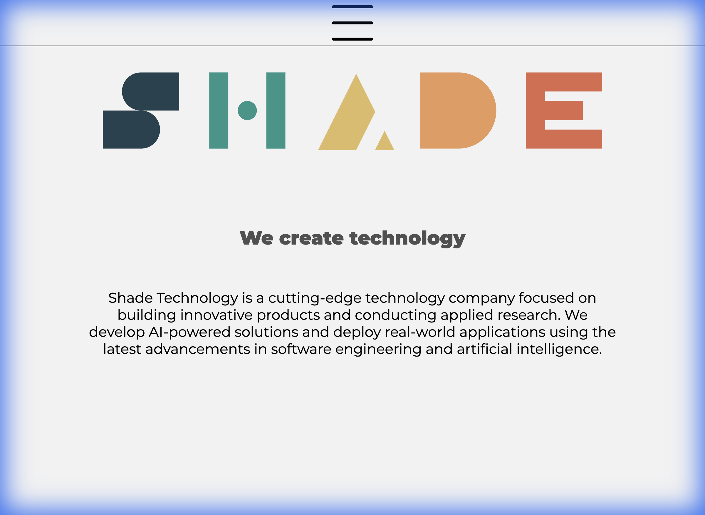
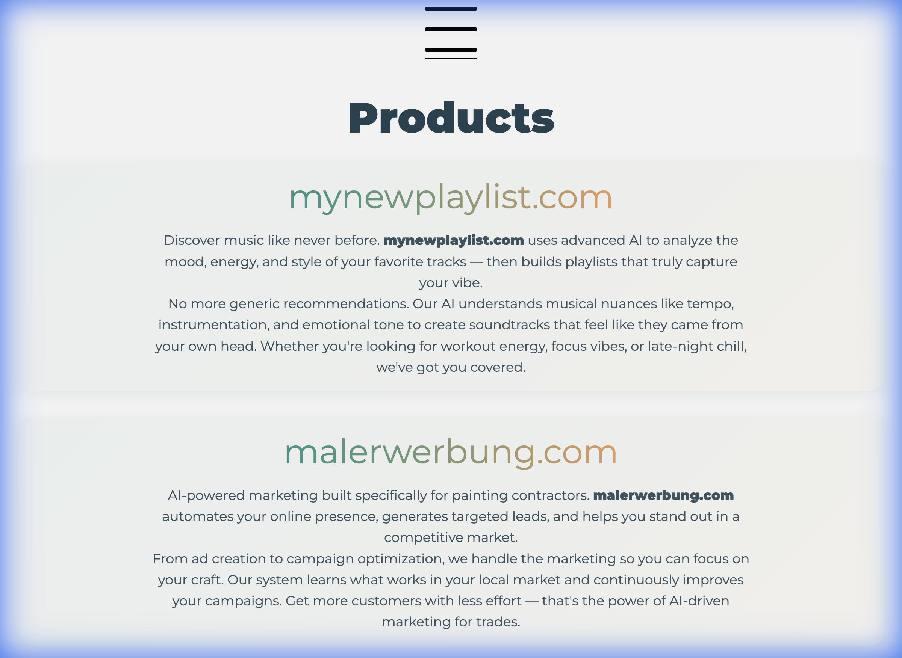

<p align="center">
  
  
  
  
  
</p>

<h1 align="center">Shade Technology</h1>

<p align="center">
  <strong>We Create Technology</strong><br>
  Cutting-edge software development, AI solutions, and applied research
</p>

<p align="center">
  <a href="https://shade-technology.de">
    
  </a>
  <a href="https://shade-technology.de/contact.html">
    
  </a>
</p>

---

## 🖼️ Preview

<table>
  <tr>
    <td align="center"><strong>Homepage</strong></td>
    <td align="center"><strong>Products</strong></td>
  </tr>
  <tr>
    <td></td>
    <td></td>
  </tr>
</table>

---

## 🚀 About

**Shade Technology UG (haftungsbeschränkt)** is a cutting-edge technology company based in Germany, focused on:

- 🔬 **Applied Research** — Pushing the boundaries of what's possible
- 🤖 **AI Solutions** — Building intelligent, AI-powered applications
- 💻 **Software Development** — Creating robust, scalable products
- 🚀 **Innovation** — Always one step ahead

> *"From concept to deployment, we turn ideas into technology that works."*

---

## 📁 Project Structure

```
shade-technology.de/
├── 📄 index.html          # Homepage
├── 📄 products.html       # Products showcase
├── 📄 contact.html        # Contact form
├── 📄 impressum.html      # Legal notice (DE)
├── 📄 datenschutz.html    # Privacy policy (DE)
├── 📄 agb.html            # Terms & Conditions (DE)
├── 📄 publications.html   # Research publications
├── 🎨 css/                # Stylesheets
│   ├── theme.css          # Design system & variables
│   ├── index.css          # Homepage styles
│   ├── nav.css            # Navigation styles
│   └── footer.css         # Footer styles
├── 📜 js/                 # JavaScript
├── 🖼️ src/                # Assets (logos, images)
├── 📄 robots.txt          # SEO robots file
└── 📄 sitemap.xml         # XML sitemap
```

---

## 🛠️ Tech Stack

<p>
  
  
  
  
</p>

---

## 🌐 Live Website

Visit us at **[shade-technology.de](https://shade-technology.de)**

---

## 📬 Contact

Have an idea that needs cutting-edge technology? Let's build something together!

- 🌐 **Website:** [shade-technology.de](https://shade-technology.de)
- 📧 **Contact Form:** [shade-technology.de/contact](https://shade-technology.de/contact.html)
- 📍 **Location:** Bobenheim am Berg, Germany

---

<p align="center">
  <sub>© 2024 Shade Technology UG (haftungsbeschränkt). All rights reserved.</sub>
</p>